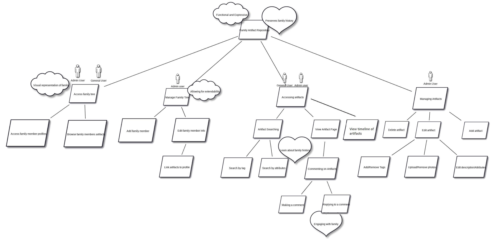

# Abstract

​	Team composed of Hanze, Alexander, Robert and Dylan, Team H.A.R.D Core, we aimed to solve our client's inconvenience. Client had a problem with sorting artifacts in his house. Artifacts are such as letters and postcards that his families used to send and dates start from  early 1900s. Because old artifacts were damaged and hard to maintain, he requested us to create a web-platform to store his artifacts (taking pictures and uploading it). Main goals that we had to achieve were as follows; a fully working family tree, upload and delete system, and an expandable database system.

# Client

**Client Name:** Leon Sterling

**Job:** Head Professor of I.T Project in University of Melbourne

**Request:** Need a Web-Platform that can store artifacts

**Main features needed:** Family Tree, Upload & Delete system, Image file support, Timeline

Yes, we had the head professor as our client. Capstone project was meant to have parents or close people around as a client. However, as the team was mostly comprised of foreign students, we decided to have Leon Sterling as our client. He kindly accepted us and two other teams. In the end, three teams experienced the capstone project very different from other graduating students. 

# Planning Process

​	Strictly following the procedure of Project Management, the team had weekly meetings, 4 sprints with the assigned advisor, and the final presentation to the client. 

Below documentations are Team H.A.R.D Core's planning.

## Goal Model

## Architecture Design

## Acceptance Testing

# Outcome

​	4 members had individual roles to perform, Hanze on CSS, Robert on Front end, Alex on presentation and myself on Back end. This project definitely gave me a very hard time.

## Back end - My part

​	With the client wanting to have three teams work on the back end together, fluent communication between three backend developers was necessary. While working on the back end, I had to attend three meetings per week, one for the sprint, another for the team, and the last for back end developers. Because three brains were working, different opinions caused troubles, and coming to an agreement took a considerable amount of time. If you are interested in the model development process, [click here.](https://gamboy45.github.io/capstoneprojectdatabaselog/)

​	First agreement was made to use Amazon S3 for the back end because of its easiness with the deployment. However, the client rejected that proposal and insisted on using SQL Workbench for the database. Thus, back end developers remodeled the database to suit the client's request. 

​	Above table design was used by Team H.A.R.D Core. You can notice a difference between the final version on database log and here because the version on the database log is to support all three teams' purposes while the version here is for our team's use only. Our team primarily focused on simplicity, extensibility, and robustness. 

​	After finishing up modeling and operating the database, my main job was finished. While Robert and Hanze were working on the front end, I was processing an enormous amount of data collected from the client's house and starting to prepare for the deployment. This process included me having to travel to the client's house to take pictures of artifacts, learning about the deployment environment, and having a cup of tea. 

## Final Display

### Login

​	A user could be an admin or a normal user. If he or she belongs to Leon's family, he or she can have one id.

### User View

​	As you can see, Leon Sterling has an artifact page and related artifacts are linked for an easy search. Moreover, a user can traverse a family tree using reactive family nodes displayed on the left side.

### Artifact Page

### Search People & Artifact Page

## After Presentation

​	The project was a success. Leon Sterling was satisfied with what we have established. Last thing needed to do was the deployment. Because the server was Linux and our local server was Windows, there were few compatibility issues. Data exportation was not smooth and the migration did not go well in due time. However, the front end migration was thankfully successful and I was able to fix the data export with manual labour. ***artifacts.leonsterling.com*** was our established site, but it is not available anymore as Leon decided to shut down the server. 

​	Because we followed the project management procedure, there were after measures to do such as the evaluation of acceptance testing.

# To Conclude...

​	This capstone project was the outside-of -school experience thanks to Leon Sterling. My experience differs from others that we followed procedures strictly and communicated with the client cohesively. If you want to have a look at source code, [here is the github for you to look at](https://github.com/gamboy45/CAPSTONEPROJECT)