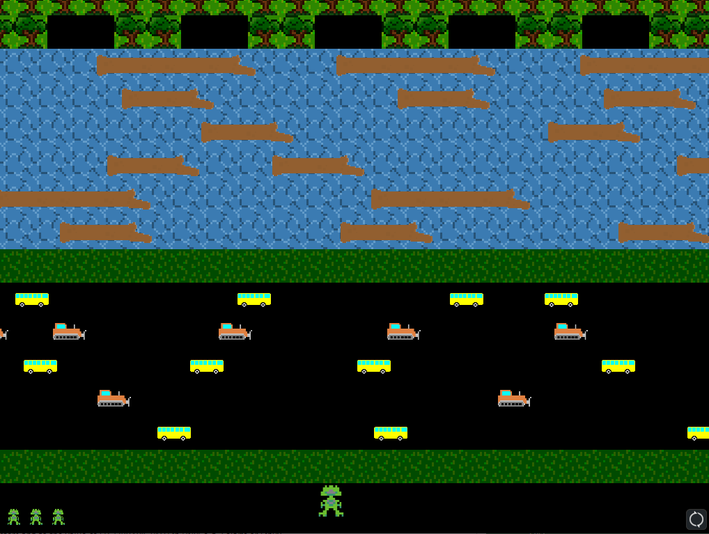
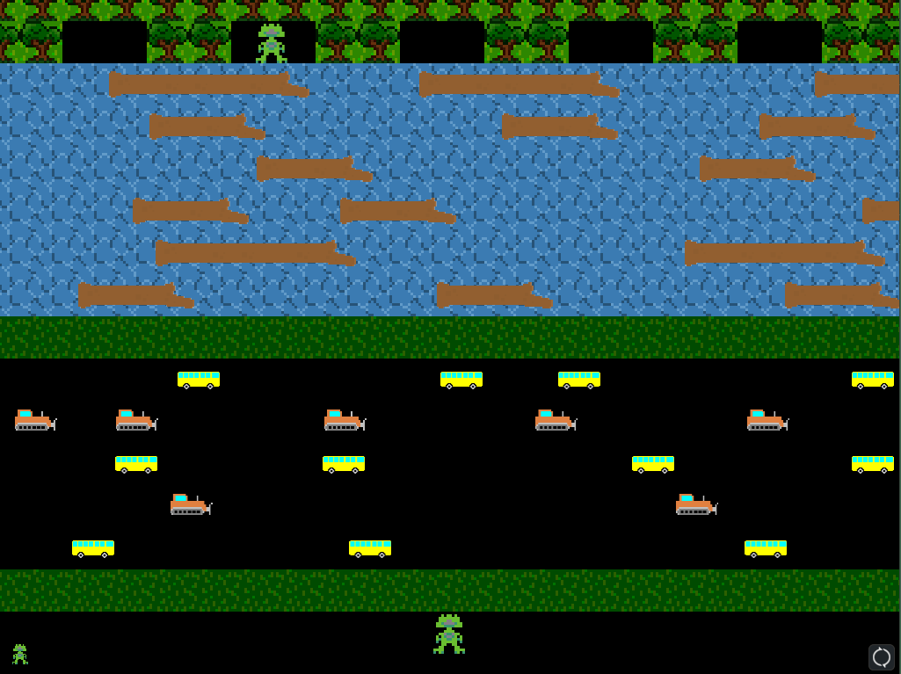
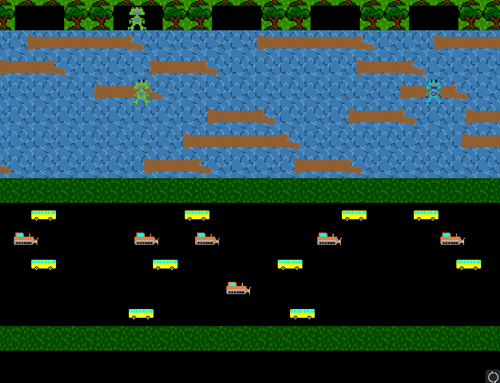
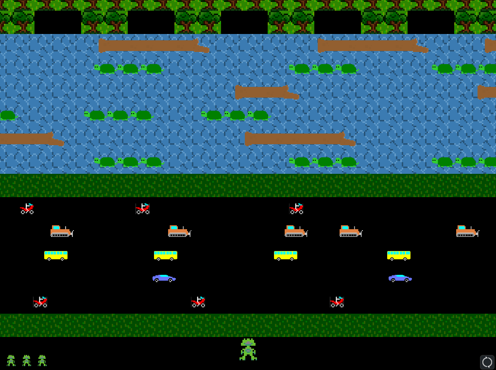

Github Link:

[JAVA Project2](https://github.com/gamboy45/JavaProject2)

# Structure

This project implements object oriented programming. This is called project 2 because the first project consisted students to make a basic implementation of this game. So, this 'Frog Game' project is the finished version of project 1 done previously.

Talking about the structure, sprite class encapsulates every object that can be present on the map. 

Objects are as follows:

​	-Frog (Player, lives, extralife)  

​	-Hazard (bike, bulldozer, bus, racecar)    

​	-Stepping materials (log, long log, turtle)   

​	-Map consisting material (grass, water) 

When the game starts, these objects are rightfully called by the World.java. 

# Game Rule

 

Player starts from the bottom of the map. 

Player gets three lives and the lives the player possess is shown on bottom left corner.

Player cannot touch water. Player needs to step on stepping materials to cross water.

Turtles disappear on certain times.

When all goals are filled, the stage level increases.

When the player is hit by an obstacle except bulldozer, he loses a life.

When encountered with a bulldozer, the player is pushed to the direction of bulldozer.

The player can obtain an extra life that gets spawned randomly on stepping materials.

# In Game Display

