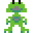
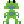
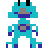
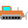
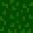

Github Link:

[JAVA Project2](https://github.com/gamboy45/JavaProject2)

# Structure

This project implements object oriented programming. This is called project 2 because the first project consisted students to make a basic implementation of this game. So, this 'Frog Game' project is the finished version of project 1 done previously.

Talking about the structure, sprite class encapsulates every object that can be present on the map. 

Objects are as follows:

​	-Frog (Player, lives, extralife)  

​	-Hazard (bike, bulldozer, bus, racecar)    

​	-Stepping materials (log, long log, turtle)   

​	-Map consisting material (grass, water) 

When the game starts, these objects are rightfully called by the World.java. 
